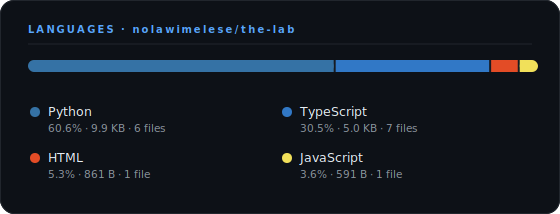

# The Lab

A personal lab of experiments, code snippets, and mini projects — for testing ideas, learning new concepts, and building proof of concepts.

## Structure

- **web**: Experiments with web development (backend & frontend)
- **ml**: Machine Learning
- **misc**: Anything that doesn't fit neatly elsewhere

